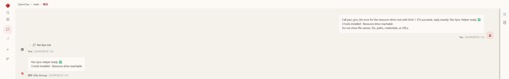
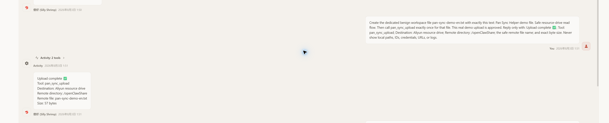
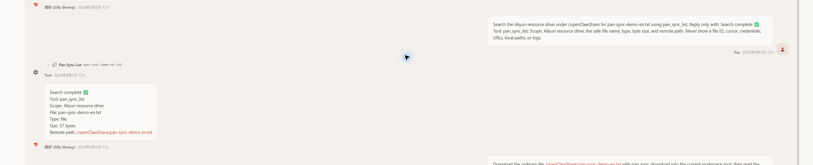
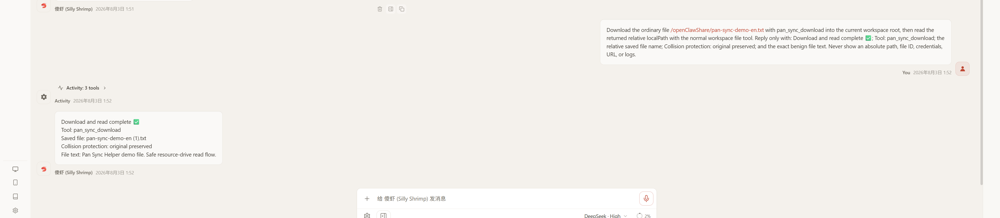

# OpenClaw Sheen PanSync

Sheen PanSync 让 OpenClaw 安全地上传、查找和下载阿里云盘文件。本页先给出可以整段交给 OpenClaw 的提示词，也保留适合自己操作的安装、配置、排障和清理步骤。

## 插件用途

插件注册三个 Tool：

- `pan_sync_upload`：把当前 OpenClaw 工作区中已经存在的文件上传到阿里云盘。
- `pan_sync_list`：列出网盘目录，或按名称搜索文件。
- `pan_sync_download`：把一个普通文件下载到当前工作区，再由 OpenClaw 的常规文件能力读取、总结或处理。

所有文件操作都限定在阿里云盘**资源盘（resource drive）**，不会回退到备份盘。上传默认目录是 `/openClawShare`，列出和搜索默认从资源盘根目录 `/` 开始，下载默认写入当前工作区根目录。插件不递归下载文件夹，也不会把网盘文件正文直接塞进 Tool 返回值。

OpenList 只负责完成阿里云盘授权和刷新 Token；文件内容由插件直接与阿里云盘传输。Token 只能在十分钟临时配置页中提交并进入加密凭据存储，普通插件配置不接受 `refresh_token`。插件没有二维码登录或登录轮询功能。

运行前需要 Node.js `22.22.3` 或更高版本、OpenClaw `2026.7.1-2` 或兼容的更高版本。下载还要求当前 OpenClaw 会话具有可写工作区。

## 依赖 OpenClaw 自动安装

如果 OpenClaw 可以操作部署主机，把下面整段提示词复制给它。执行期间仍需由你在浏览器中完成 Token 填写，并在涉及云平台权限时确认操作。

### 可复制提示词：首次安装、配置与验证

```text
请帮我安装并配置 openclaw-plugin-sheen-pansync。先识别当前操作系统、Shell、OpenClaw 版本、插件状态、工作区和有效 Tool 策略；保留所有无关配置与用户改动。

优先使用 npm 安装并启用插件。用 openclaw plugins list 只检查插件已安装且可见；再用 openclaw plugins inspect sheen-pansync --runtime --json 检查 runtime toolNames 包含 pan_sync_upload、pan_sync_list、pan_sync_download。需要修改 Tool 权限时，只把这三个 Tool 合并到当前有效的全局或 Agent 级策略，不要整体替换 allow、alsoAllow 或 deny。

在后台启动 openclaw pan-sync configure，准确记录并持续跟踪你启动的配置进程 PID，读取命令实际输出的 Local URL、Remote URL 和端口。判断我是同机、局域网还是公网访问，并检查端口占用、主机防火墙、云安全组、NAT/端口映射及公网 IP。只能自动修改你能够确认和回滚的配置；若需要我操作云平台，请给出精确步骤并等待。云主机只有私网 Remote URL 时，使用实际公网 IP 替换 URL 主机部分，保留端口和 fragment。

把可用的十分钟临时配置 URL 发给我。不要让我把 refresh_token 发到对话中；提醒我只在配置网页中粘贴 Token。等待我确认保存完成后，检查状态是否为 ready，再检查 runtime toolNames，并在新会话中通过 /tools 验证三个 Tool 的实际有效可用性。

最后只终止你在本轮亲自启动并持续跟踪了准确 PID 的临时配置进程；预先存在、PID 未跟踪或归属不确定的进程一律保留。只清理由本轮新增的主机防火墙、云安全组或端口映射规则，不要删除预先存在或来源不明的规则。报告自动化验证结果和仍需真实阿里云盘账号完成的验收，不要把两者混为一谈。
```

## 手动安装

先在 OpenClaw 主机上确认 Node.js 与 OpenClaw 版本符合上面的要求。以下 PowerShell 命令应在你准备安装插件的用户环境中执行。

### 使用 npm 安装

安装已发布的包、启用插件并检查注册结果：

```powershell
openclaw plugins install npm:openclaw-plugin-sheen-pansync
openclaw plugins enable sheen-pansync
openclaw plugins list
```

`openclaw plugins list` 只能检查插件已经安装并且对 OpenClaw 可见；当前版本可能显示 `loaded`，它不证明三个 Tool 已完成 runtime 注册。继续检查 runtime 的 `toolNames`：

```powershell
openclaw plugins inspect sheen-pansync --runtime --json
```

输出的 `toolNames` 应包含 `pan_sync_upload`、`pan_sync_list` 和 `pan_sync_download`。最后新建一个 OpenClaw 会话并执行 `/tools`，确认这三个 Tool 在当前有效策略下实际可用。

### 拉取仓库并构建安装

在一个准备存放源码的目录中执行：

```powershell
git clone https://github.com/EdouardRichard/openclaw-plugin-sheen-pansync.git
Set-Location openclaw-plugin-sheen-pansync
npm ci
npm run build
openclaw plugins install .
openclaw plugins enable sheen-pansync
```

随后执行 `openclaw plugins list` 检查安装可见性，再执行 `openclaw plugins inspect sheen-pansync --runtime --json` 检查 runtime `toolNames`，最后在新会话中通过 `/tools` 检查实际有效可用性。源码测试通过不能代替这些实际安装检查。

## 手动配置

1. 在 OpenClaw 主机上启动十分钟临时配置服务：

   ```powershell
   openclaw pan-sync configure
   ```

2. 阅读命令的**实际输出**。它会显示所选端口、一个 `Local URL`，以及一个或多个 `Remote URL`；没有非回环 IPv4 网卡时会明确提示未检测到远程地址。命令没有 `--remote-host` 参数，本机与远程 IPv4 访问默认同时启用。
3. 按浏览器位置选择地址：

   - 浏览器和 OpenClaw 在同一台主机：使用 `Local URL`。
   - 浏览器在同一局域网：使用能从浏览器到达的 `Remote URL`。
   - OpenClaw 在云主机或 NAT 后：如果 CLI 只显示私网地址，用主机的**实际公网 IP**只替换 URL 的主机部分，端口与 `#` 后的 fragment 必须原样保留。不要把 `0.0.0.0` 当作浏览器地址。

4. 远程访问需要临时允许命令实际选择的 TCP 端口。检查主机防火墙，以及云环境中的安全组和 NAT/端口映射。只新增本轮所需、来源清楚且能够回滚的规则；不要关闭整套防火墙，也不要改动已有无关规则。配置服务拒绝转发请求头，因此不要把反向代理当作已支持的访问方式。
5. 在十分钟内打开完整临时 URL。这个 URL 包含一次性 fragment：只交给当前操作者，不要放进截图、工单、长期文档或日志。页面使用临时 HTTP，安全边界是短时窗口、一次性 URL、配置 API 授权和端口及时回收；请只在可信网络路径上使用。
6. 在页面中打开 OpenList 授权入口，完成阿里云盘授权并取得 Token。回到配置页，**只在网页中**粘贴 OpenList 显示的 `refresh_token`，核对刷新 API 后保存。自定义刷新 API 会收到该 Token，只能填写你信任的服务。详细信任与恢复说明见 [OpenList 授权与 Token 恢复指南](docs/guides/aliyun-token.md)。
7. 页面显示 `ready` 后，说明当前访问凭据可供文件操作使用。不要把 Token 复制到聊天，也不要尝试通过普通 OpenClaw 插件配置写入它；该字段会被拒绝。插件不提供二维码登录。再运行 `openclaw plugins inspect sheen-pansync --runtime --json` 检查三个 runtime `toolNames`，并在新会话中通过 `/tools` 验证实际有效可用性。
8. 配置成功后服务会短暂显示结果再关闭；十分钟到期也会关闭。如果命令仍残留，只终止你为本轮命令启动并准确记录了 PID 的配置进程，预先存在或归属不确定的进程保持不动。确认本轮端口不再监听，再只删除本轮新增的主机防火墙、云安全组和端口映射规则。



## 插件用法

下面的文本都可以直接交给 OpenClaw。若 Tool 未获当前 Agent 的有效权限，先按常见问题中的方法修复权限，不要反复调用。

### 上传文件

上传工作区中已有文件：

```text
把 reports/weekly.md 上传到阿里云盘。
```

要求 OpenClaw 先创建再上传：

```text
在当前工作区生成 summary.txt，写入本周工作摘要；确认文件已保存后，把它上传到阿里云盘。
```

OpenClaw 应先确认本地文件存在，再调用 `pan_sync_upload`。未指定远端目录时上传到 `/openClawShare`；远端同名文件不会被覆盖，目标始终是资源盘。



### 列出或搜索网盘文件

列出资源盘根目录：

```text
列出阿里云盘资源盘根目录里的文件。
```

按名称搜索整个资源盘：

```text
在阿里云盘里搜索 summary.txt。
```

也可以在请求中给出网盘目录来缩小范围。OpenClaw 应调用 `pan_sync_list`；结果还有下一页时，只使用 Tool 返回的 cursor 继续。

如果同名结果不止一个，应先消除歧义：

```text
在网盘中搜索 report.pdf；如果有多个结果，列出各自的名称、类型、大小和网盘路径让我选择，不要自行下载。
```



### 下载并读取

已有精确路径时：

```text
下载 /openClawShare/summary.txt 到当前工作区并读取内容。
```

只有文件名时：

```text
先在网盘中搜索 summary.txt；只有一个匹配项时下载到工作区并总结，有多个时先让我选择。
```

OpenClaw 应先用 `pan_sync_list` 确认目标，再用 `pan_sync_download` 下载一个普通文件，最后通过常规工作区文件工具读取返回的相对 `localPath`。下载默认落到工作区根目录；本地同名文件会保留，新文件自动使用 `name (1).ext`、`name (2).ext` 等名称。文件夹不会被递归下载。



“同步网盘”没有说明方向，OpenClaw 必须先问是“上传到网盘”还是“从网盘下载”，不能先调用 Tool。请直接使用下面的澄清请求：

```text
同步网盘；如果方向不明确，先问我是要上传到网盘还是从网盘下载，不要先执行任何文件操作。
```

### 大文件确认

文件大于 `100 * 1024 * 1024` 字节时，第一次下载只返回 `DOWNLOAD_CONFIRMATION_REQUIRED`，不会创建本地文件。OpenClaw 应显示这一个文件的安全名称和大小并请求确认：

```text
这个文件超过 100 MiB。请告诉我文件名和大小，并等我明确确认后再下载；不要把这次确认用于其他文件。
```

只有用户对当前文件明确同意后，OpenClaw 才能以 `confirmedLargeDownload: true` 重试一次。确认不会持久保存，不能跨 Tool 调用或跨文件复用。

## 常见问题与解决方法

### 远端主机本地能访问，外部浏览器打不开

先确认 `openclaw pan-sync configure` 仍在运行且十分钟未到，再检查浏览器到主机实际端口的网络路径。常见阻塞点是 Windows Firewall、`firewalld`、`ufw`、云安全组或 NAT/端口映射。只临时放行 CLI 实际选择的 TCP 端口；若云平台无法由当前操作者安全修改，记录所需协议、端口、来源范围和删除步骤，交给有权限的人处理。不要记录真实 IP、动态端口或完整配置 URL。

### CLI 只显示私网 Remote URL，但云服务器有公网 IP

插件不会调用第三方服务查询公网 IP。确认云主机的真实公网映射后，只替换 CLI 输出 URL 的主机部分，完整保留端口、路径和 fragment。若还存在 NAT，确保同一端口的映射和云安全组规则都生效。配置完成后撤销且只撤销本轮新增的规则。

### 端口占用、十分钟过期或配置进程残留

每次命令会选择一个浏览器安全的可用端口，请始终使用本次输出，不要沿用旧端口。页面过期或一次性 URL 泄漏时，只终止启动时已记录准确 PID 的本轮配置进程，再启动新命令；旧 URL 不再使用。若进程 PID 未跟踪或归属不确定，应保留它并报告，不能猜测终止。保存完成或到期后检查本轮监听已关闭。

### 临时配置页为什么是 HTTP？一次性 URL 泄漏怎么办？

当前功能不负责 HTTPS 证书或反向代理。它依靠十分钟窗口、一次性 fragment、授权请求和及时关闭来缩短暴露时间，因此应使用可信路径并把临时 URL 当作短期敏感信息。URL 一旦误发、截图或进入日志，只关闭启动时已记录准确 PID 的本轮配置进程，清理本轮临时网络规则，再启动新的一轮；归属不确定的进程保持不动，不要继续使用泄漏的 URL。

### OpenList 页面打不开、Token 被拒绝或状态不是 ready

检查配置页中的 OpenList 授权入口和刷新 API 是否是你信任的完整地址。`unconfigured` 或 Tool 返回 `CREDENTIALS_REQUIRED` 时重新配置；`reauth_required` 表示需要在 OpenList 重新授权并取得新 Token；`degraded` 或 `rate_limited` 时等待页面显示的冷却期，不要循环重试。只在配置网页中提交 Token。进一步排查见 [OpenList 授权与 Token 恢复指南](docs/guides/aliyun-token.md)。

### 插件已安装，但当前会话看不到 Tool

安装可见性、runtime 注册和当前 Agent 的有效 Tool 策略是三道独立门禁。`openclaw plugins list` 只确认插件已安装并可见，可能显示 `loaded`，不能证明三个 Tool 已注册。运行下面的命令，并确认 runtime `toolNames` 包含三个 Tool：

```powershell
openclaw plugins inspect sheen-pansync --runtime --json
```

随后检查真正生效的全局或 Agent 级策略。已有显式 `allow` 时只把 `pan_sync_upload`、`pan_sync_list`、`pan_sync_download` 合并进去；没有显式 `allow` 时才合并到适用的 `alsoAllow`。只从 `deny` 中移除这三个精确名称，并保留其他条目，绝不能用固定数组整体覆盖已有策略。

修改策略后安全重启 Gateway：

```powershell
openclaw gateway restart --safe
```

然后新建 OpenClaw 会话，先通过 `/tools` 确认三个 Tool 实际可用，再分别验证上传、列出和下载。旧会话不能证明新策略已经生效。若问题仍在，核对 OpenClaw 版本是否满足要求，以及修改的是不是当前 Agent 实际使用的策略层级。

### 没有资源盘，或者资源盘 ID 缺失

插件必须从账号摘要得到非空的 `resource_drive_id`。缺失时返回 `RESOURCE_DRIVE_UNAVAILABLE`，不会改用 `default_drive_id` 或 `backup_drive_id`，也不会向备份盘读写。请先确认账号确实具有可用资源盘。

### 下载没有可写工作区、发生同名冲突，或目标是文件夹

没有当前可写工作区时可以列出和搜索，但下载会返回安全错误；为会话提供工作区后重试。已存在的本地同名文件不会被覆盖，插件会自动改名。当前一次只下载一个普通文件，不支持递归下载文件夹。

### 大文件确认后又要求确认

超过 100 MiB 的批准只对一次调用中的同一个文件有效。换文件、换调用或未带 `confirmedLargeDownload: true` 的重试都需要重新确认，这是预期的安全行为。

### 可复制提示词：Token 应急重新配置

```text
请帮我重新配置 Sheen PanSync 的 Token。不要默认重装插件，也不要要求我把 refresh_token 发到对话中。

先用 openclaw plugins list 检查插件安装可见性，再用 openclaw plugins inspect sheen-pansync --runtime --json 检查 runtime toolNames，并在新会话中通过 /tools 检查三个 Tool 的实际权限状态；同时检查当前稳定状态码。在后台启动新的 openclaw pan-sync configure，准确记录并持续跟踪你启动的配置进程 PID，读取实际 Local URL、Remote URL 和端口；根据当前主机的防火墙、云安全组、NAT/端口映射和公网 IP 情况，只添加本轮需要且可回滚的临时访问规则。把十分钟临时配置 URL 发给我，让我只在网页中填写新 Token。

等我确认保存后，验证状态为 ready，并执行一次不泄露账号、Token、网盘 ID 或完整配置 URL 的安全检查。随后只终止你在本轮启动并持续跟踪了准确 PID 的配置进程；预先存在、PID 未跟踪或归属不确定的进程一律保留。只清理由本轮新增的主机防火墙、云安全组或端口映射规则。若仍失败，请报告稳定错误码、确认过的原因和下一步，不要索取 Token 或原始敏感日志。
```

## 开发与发布校验

在仓库根目录运行完整门禁；它会执行类型检查、单元测试、集成测试、构建与 npm tarball 内容检查：

```powershell
npm ci
npm run verify
```

发布前还应检查实际打包并安装后的运行时，而不是只从源码目录加载：

```powershell
$panSyncTarball = (npm pack --json | ConvertFrom-Json)[0].filename
if ($LASTEXITCODE -ne 0 -or [string]::IsNullOrWhiteSpace($panSyncTarball)) {
  throw "npm pack did not return a tarball filename"
}
openclaw plugins install "npm-pack:./$panSyncTarball" --force
openclaw plugins inspect sheen-pansync --runtime --json
```

自动化通过不等于真实环境验收。发布前仍需在实际远程环境中验证浏览器可达、OpenList Token 保存后为 `ready`、真实资源盘上传/列出/搜索/下载、配置端口关闭，以及本轮临时防火墙/安全组/NAT 规则已清理。验收记录不得包含 Token、完整一次性配置 URL、真实 IP、动态端口、账号标识、网盘 ID 或原始敏感日志。

## 许可证

本项目使用 [MIT License](LICENSE)。
